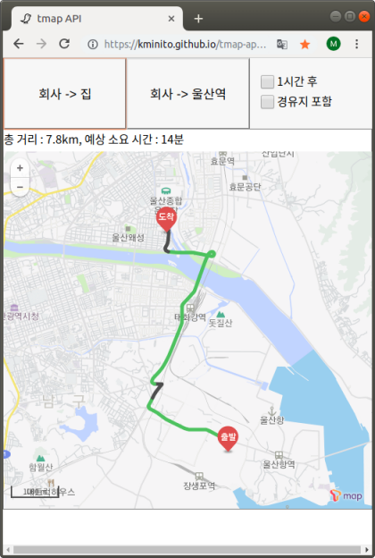
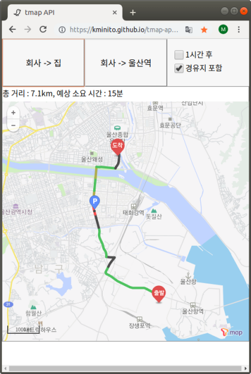

# T-map API 사용 경로 탐색

자주 가는 출발/도착/경유 장소를 미리 설정해두어, 휴대폰 T map 앱을 사용하지 않고 웹페이지에서 바로 실시간 교통정보 및 1시간 후 출발시 소요시간을 확인할 수 있도록 합니다.

github page를 이용하여 호스팅하면 간편하게 사용이 가능합니다.

_퇴근할 때 '언제갈까' 실행하기가 귀찮고, 또 원래 가던 길로 가면 얼마나 오래 걸리는지 확인하는 것을 쉽고 간단하게 하고자 만들었습니다. 부족한 점이 많으니 이해 부탁드립니다. Vanilla Javascript + HTML + CSS로 만들었습니다._

**사용 화면**  
(동영상 : https://youtu.be/HZMU004A8Do)  
 

- '회사 -> 집' 혹은 '회사 ->울산역' 버튼 클릭시 티맵의 경로안내 기능 실행 : 실시간 교통 정보 및 총 거리, 소요시간 표시
- '1시간 후' 박스 선택 후 경로 탐색시 티맵의 '언제갈까'기능을 이용하여 1시간 후 출발시 총 거리 및 소요시간을 표시함
- '경유지 포함' 박스 선택 후 경로 탐색시 설정된 경유지를 포함하여 경로를 탐색함.

## 사용 방법

### 준비물

- T MAP API를 사용하기 위한 인증키
  : https://developers.sktelecom.com/ 에서 무료 발급 (경로안내 1일 사용한도 1,000건)

### 인증키 설정

- `js/data.js` 파일의 `authKey` 변수에 인증키를 입력

### 위치 데이터 입력

- `js/data.js` 파일의 `places` 변수에 장소 리스트를 작성  
   (장소의 경도와 위도는 구글맵에서 확인 가능)

  ```js
  var places = {
    workplace: {
      name: "회사",
      locX: 129.362834, //경도
      locY: 35.513491 //위도
    },
    samsan: {
      name: "삼산동",
      locX: 129.339781,
      locY: 35.538173
    }
  };
  ```

- 위에서 입력한 장소 리스트의 key 값을 바탕으로 `js/data.js` 파일의 `route1` 및 `route2` 변수에 [출발지 key, 도착지 key, 경유지 key]의 형식으로 경로를 입력

  ```js
  var route1 = ["workplace", "home", "samsan"];
  ```

- index.html 파일 실행하여 경로 탐색

## 참고 사항

- 모바일 인터넷 브라우저에서 사용 가능
- 출발/도착/경유지는 총 두 세트까지 설정 가능
- '1시간 후' 옵션 선택시 티맵의 '언제갈까' 기능으로 경로를 검색하므로 실시간 교통정보가 포함되지 않음.
- 경로 표시 옵션은 '최적길 안내'로 세팅되어 있으나 `findpath.js` 및 `whentogo.js`에서 변경 가능

#### 파일 설명

- data.js : 인증키, 경로, 장소 좌표 등 데이터 저장
- logic.js : 작동 로직
- whentogo.js : 경로탐색 API 사용
- whentogo.js : 언제갈까 API 사용

#### 관련 T-map API 문서

#### 부족하다고 느끼는 점  
- 예외 처리: 인증키가 잘못되었을 경우 어떻게 표시해야 할지 모르겠음. 그리고 전반적으로 예외처리가 전혀 되지 않았는데, 나중에 더 배우게 되면 수정을 하고 싶다.
- 인증키 관리 : 공개되는 것은 적절하지 않아 보이나, 방법을 모르겠다.
- 코드에 주석 달기 : 그때그때 써놓을 걸 하고 후회가 된다. 

http://tmapapi.sktelecom.com/main.html#webservice/docs/tmapRouteDoc  
http://tmapapi.sktelecom.com/main.html#webservice/docs/tmapRoutePredictionDoc  
http://tmapapi.sktelecom.com/main.html#web/usecase/UseCasePathSearch


많은 지적 부탁드립니다.  
kminito / gatsbyfor@gmail.com
